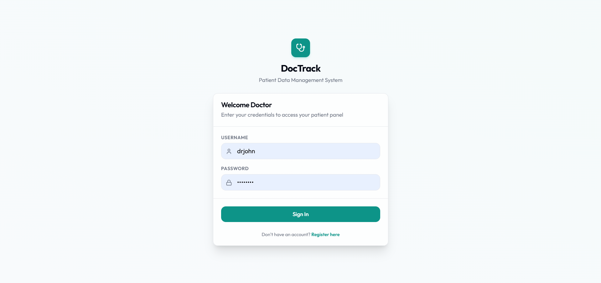
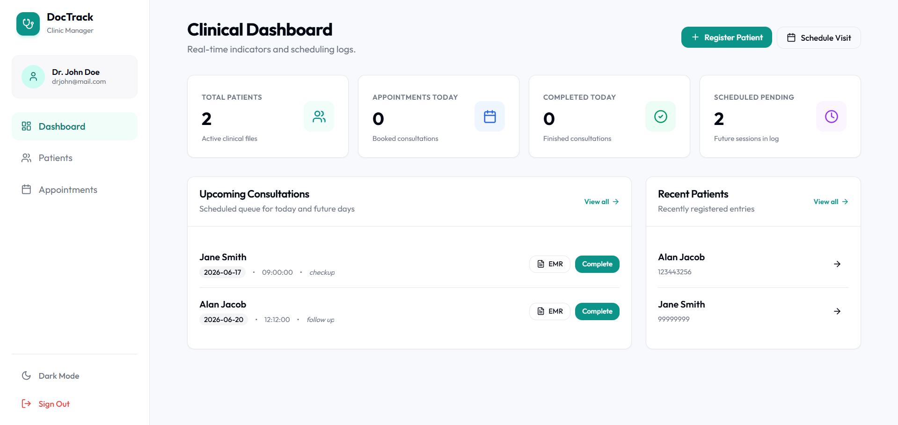
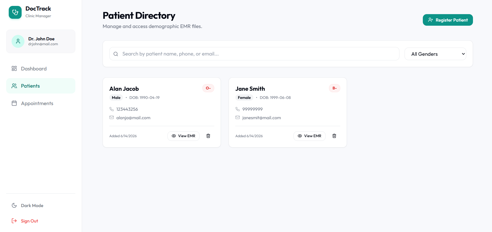
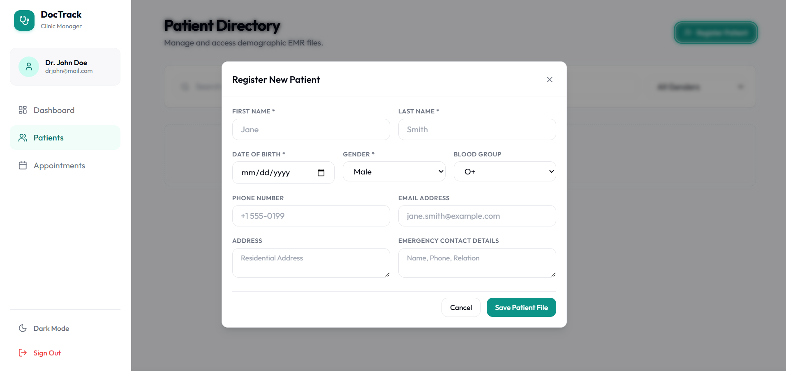
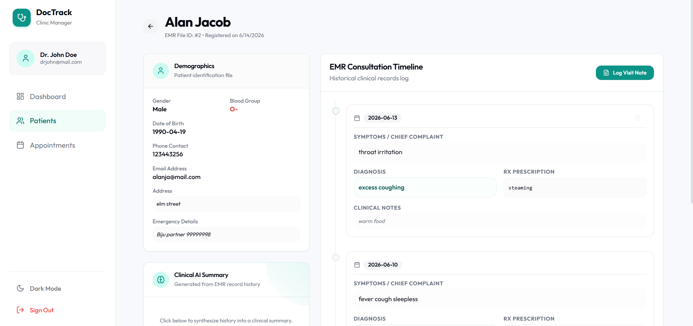
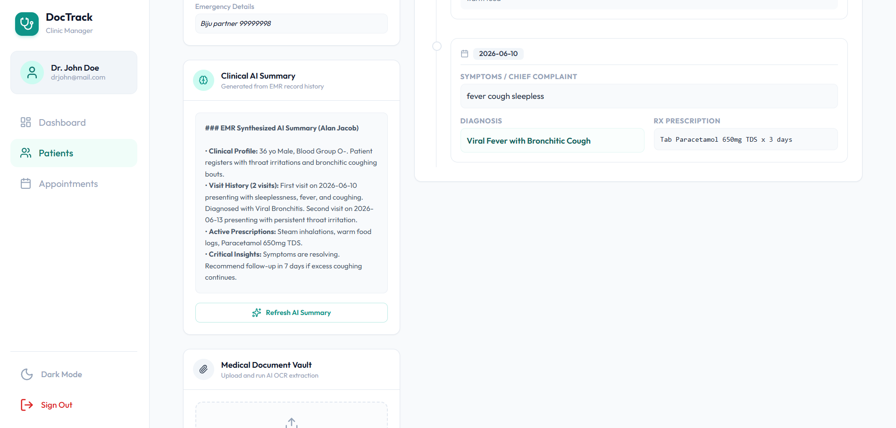
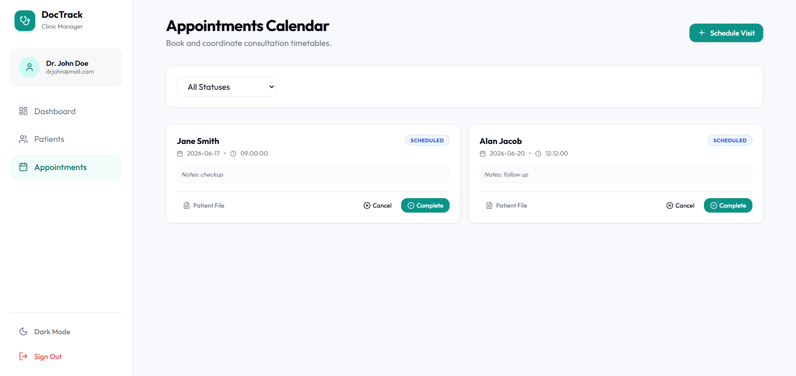

# DocTrack

DocTrack is a secure, multi-tenant Patient Data Management System and Electronic Medical Record (EMR) portal designed for independent clinics and practitioners. The platform establishes isolated clinical workspaces, enabling secure patient registration, structured visit timeline tracking, and media document storage.

DocTrack includes an integrated clinical assistant pipeline powered by Large Language Models (LLMs) to automate structured SOAP note formatting, history timelines synthesis, and lab report optical character recognition (OCR).

---

## Interface Preview

*Explore the user interface screens of DocTrack:*

### Secure Login Screen

*Secure practitioner entrance to access doctor-owned patient files.*

---

### Clinical Dashboard

*Real-time statistics metrics showing total patients, today's appointments, completed visits, and active consultation queues.*

---

### Patient EMR Directory

*Roster view of all active clinic patient files with search and gender filtering.*

---

### Patient Registration Form

*Demographics entry card to register new patients and collect contact details.*

---

### Patient EMR History & Timeline

*Comprehensive visit timeline displaying symptoms, diagnoses, prescriptions, and media attachment vaults.*

---

### Clinical AI Summary Panel

*Synthesized EMR clinical history overview generated dynamically.*

---

### Appointments Calendar

*List view to schedule, reschedule, complete, or cancel patient visits.*

---

## Key Features

*   **Secure Doctor Authentication**: JWT-based session controls (`djangorestframework-simplejwt`).
*   **Strict Tenancy Isolation**: Multi-doctor isolation ensures each practitioner can only query, modify, or view their own registered patients and appointments.
*   **Demographics EMR Vault**: Full CRUD logs with cascading soft-delete (automatically cancels future appointments on patient deletion).
*   **EMR Visit Timeline**: Visual timeline log displaying visit dates, symptoms, diagnoses, prescriptions, and custom follow-up notes.
*   **Appointment Scheduler**: Custom appointment calendar showing scheduled, completed, and cancelled visits.
*   **AI Clinical Assistant (Gemini API Integration)**:
    *   **SOAP Formatter**: Auto-formats doctor visit shorthand scribbles into formatted SOAP summaries.
    *   **Clinical EMR Summarizer**: Synthesizes historical patient visit records into a singular clinical summary.
    *   **Multimodal OCR**: Processes prescription/lab images and extracts medical entities directly into the consultation note fields.
    *   *Mock Fallback Mode: Seamless local testing even without active Gemini keys.*

---

## Technology Stack

### Backend
*   **Django 5.x** & **Django REST Framework (DRF)**
*   **SimpleJWT** (JWT Authentication)
*   **Neon PostgreSQL** (Production) / SQLite (Local development)
*   **Cloudinary** (Secure medical report storage)
*   **Google Generative AI** (`gemini-1.5-flash` model integration)
*   **drf-spectacular** (Interactive Swagger & Redoc OpenAPI specs)

### Frontend
*   **React 19** & **Vite** & **TypeScript**
*   **Tailwind CSS** (Custom theme configurations)
*   **TanStack React Query v5** (Server state management & polling)
*   **React Router v7** (Secure SPAs routing)
*   **Lucide React** (Vector icons)

---

## Project Directory Structure

```text
DocTrack/
├── backend/                 # Django EMR API
│   ├── doctrack/            # Settings and root urls
│   ├── api/                 # EMR models, serializers, views, and AI logic
│   ├── requirements.txt     # Python dependencies
│   └── .env.example         # Environment credentials template
│
└── frontend/                # React Vite SPA Client
    ├── src/
    │   ├── components/      # UI Shell Layout and custom components
    │   ├── context/         # AuthContext JWT session management
    │   ├── pages/           # Pages (Dashboard, Patients, Appointments, Details)
    │   └── services/        # Axios API client interceptors
    ├── tailwind.config.js   # Theme design tokens
    ├── vercel.json          # SPA rewrite rules
    └── .env.example         # Client API url template
```


---

## Local Quick Start

### Prerequisites
*   Python 3.11+
*   Node.js 18+ & npm

### 1. Backend Setup
1. Navigate to the backend directory:
   ```bash
   cd backend
   ```
2. Create and activate a Python virtual environment:
   ```bash
   python -m venv venv
   # On Windows (PowerShell):
   ..\venv\Scripts\activate
   # On macOS/Linux:
   source ../venv/bin/activate
   ```
3. Install dependencies:
   ```bash
   pip install -r requirements.txt
   ```
4. Configure environment secrets:
   * Copy `.env.example` to `.env`
   * *(Optional)* Add a `GEMINI_API_KEY` or Cloudinary keys. If left blank, mock engines will run automatically.
5. Apply database migrations:
   ```bash
   python manage.py migrate
   ```
6. Start the API server:
   ```bash
   python manage.py runserver
   ```
   The Swagger OpenAPI specifications are accessible at `http://localhost:8000/api/schema/swagger-ui/`.

---

### 2. Frontend Setup
1. Navigate to the frontend directory:
   ```bash
   cd frontend
   ```
2. Install package node modules:
   ```bash
   npm install
   ```
3. Configure environment variables:
   * Copy `.env.example` to `.env`
4. Start the local client development server:
   ```bash
   npm run dev
   ```

---

## Live Deployment

The system is configured for cloud environments and deployed on the following infrastructure:
*   **Backend API**: Python WSGI server served by **Render**
*   **Frontend Client**: Single Page Application (SPA) served by **Vercel**
*   **Database**: Managed PostgreSQL instance provisioned on **Neon**
*   **Medical Document Vault**: File storage API managed by **Cloudinary**

---

## License
This project is licensed under the MIT License.
